<h2>TensorFlow-FlexUNet-Image-Segmentation-EMIDEC (2026/07/19)</h2>
Sarah T.  Arai 
Software Laboratory antillia.com  
This is the second experiment of Image Segmentation for 
<a href="https://emidec.com/dataset"><b>
EMIDEC (Evaluation of Myocardial Infarction from Delayed-Enhancement Cardiac MRI)
</b>
</a> based on our <a href="https://github.com/sarah-antillia/TensorFlow-FlexUNet-Image-Segmentation-Model">
TensorFlow-FlexUNet-Image-Segmentation-Model</a> 
(TensorFlow Flexible UNet Image Segmentation Model for Multiclass) , 
and a 512x512 pixels PNG
<a href="https://drive.google.com/file/d/17P8uRqDm4flK6sXtcm7rY2XU7ciESE2Y/view?usp=sharing">
<b>EMIDEC-Heart-MRI-ImageMask-Dataset-V2.zip</b></a> with colorized masks 
(<a href="https://creativecommons.org/licenses/by-nc-sa/4.0/legalcode">CC BY-NC-SA 4.0</a>), which was derived by us from   
<a href="https://www.kaggle.com/datasets/johnsonhk88/emidec-dataset-for-heart-mri-image">
<b>EMIDEC Dataset For Heart MRI Image</b> </a> by ohnson chong.
  

<b>Actual Image Segmentation for EMIDEC-Heart-MRI of 512x512 pixels </b> 
As shown below, the inferred masks predicted by our segmentation model trained by the dataset appear similar to the 
ground truth masks, except the third case.
  
<b>class_color_map={class_1:blue, class_2:green, class_3:red, class_4:cyan}</b>
  
<table>
<tr>
<th>Input: image</th>
<th>Mask (ground_truth)</th>
<th>Prediction: inferred_mask</th>
</tr>
<tr>
<td>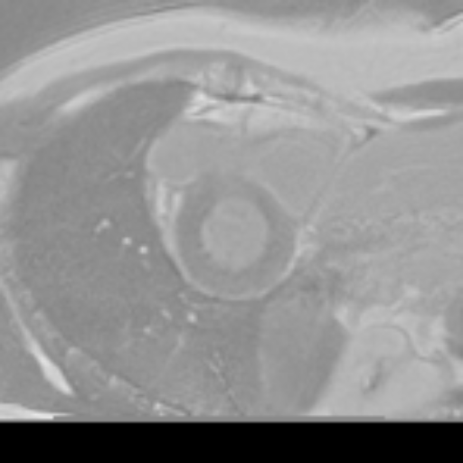</td>
<td></td>
<td></td>
</tr>
<tr>
<td>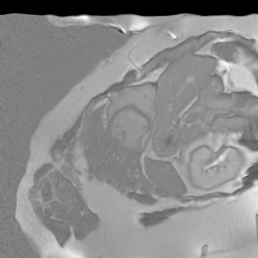</td>
<td>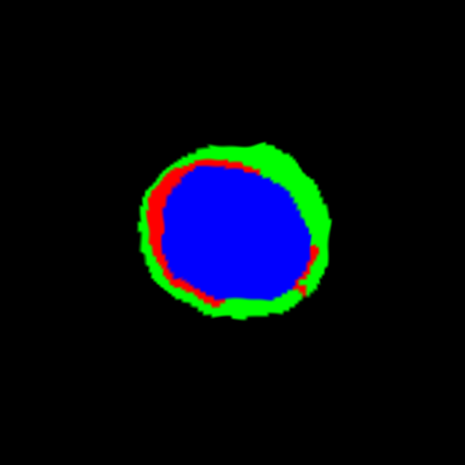</td>
<td>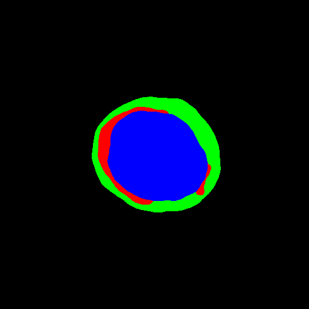</td>
</tr>
<tr>
<td>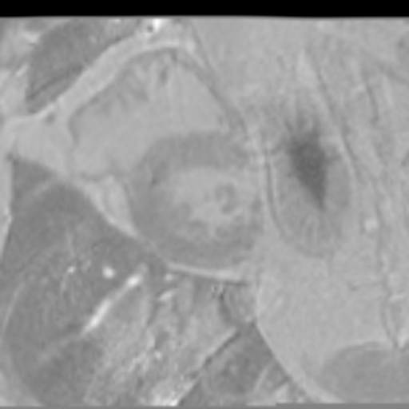</td>
<td>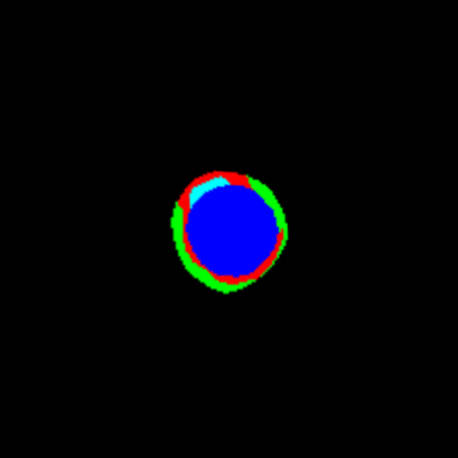</td>
<td></td>
</tr>
</table>

 
<h3>1  Dataset Citation</h3>
The dataset used here was derived from   
<a href="https://www.kaggle.com/datasets/johnsonhk88/emidec-dataset-for-heart-mri-image">
<b>EMIDEC Dataset For Heart MRI Image</b> </a> by ohnson chong.  
The following explanation was taken from the web site.
  
<b>About Dataset</b> 
<b>Dataset Information</b> 
EMIDEC (Evaluation of Myocardial Infarction from Delayed-Enhancement Cardiac MRI) is a dataset aimed at 
assessing the extent of myocardial infarction.  
This dataset includes delayed-enhancement magnetic resonance imaging (DE-MRI) of multiple patients 
taken minutes after contrast injection, manually annotated to identify several myocardial 
infarction-related areas including the myocardial outline, infarction regions, 
and permanent microvascular obstruction areas (no reflow zones), forming a segmentation dataset.  
It comprises 150 cases (all from different patients), including 50 cases with normal MRI
 post-contrast injection and 100 cases of myocardial infarction (appearing as enhanced areas on DE-MRI). 
The dataset includes 100 training cases and 50 test cases.
  
The dataset, with 150 clinical MRI images and associated clinical features of myocardial infarction, 
holds significant research value.  
It provides a foundation for assessing and automatically detecting myocardial infarctions, aiding in 
the development of automated algorithms to identify areas of myocardial damage, and supporting 
the development of diagnostic tools based on imaging and clinical data.  
Due to its large number of cases and comprehensive information, 
this dataset has significant potential for application in the diagnosis and treatment of myocardial infarction.
  
<b>Dataset Meta Information</b> 
Dimensions Modality Task Type Anatomical Area Number of Categories Data Volume File Format
3D DE-MRI Segmentation Heart 4 150 .nii.gz  
<b>Resolution Details</b> 
Dataset Statistics spacing (mm) size 
min (1.367, 1.367, 8.0) (139, 120, 4) 
median (1.458, 1.458, 10.0) (240, 256, 7) 
max (1.875, 1.875, 13.04) (305, 308, 10) 
 
Number of 2D slices in the dataset: 708. 
 
<b>Label Information Statistics</b> 
Only 100 examples in the training set are counted.  
<table border="1">
<tr>
<th>Region</th>
<th> Number of Cases</th>
<th>Completion Rate</th>
<th> Minimum Volume (cm³)</th>
<th> Median Volume (cm³)</th>
<th> Maximum Volume (cm³)</th>
</tr>
<tr>
<td>Left Ventricle</td><td>100</td><td>100%</td><td> 49.28</td><td>105.46</td><td> 280.77</td>
</tr>
<tr>
<td>Myocardium</td><td>100</td><td>100%</td><td> 53.81</td><td> 96.5</td><td> 153.83</td>
</tr>
<tr>
<td>Myocardial Infarction</td><td> 67</td><td> 67%</td><td> 2.39</td><td> 20.26</td><td> 80.1</td>
</tr>
<tr>
<td>No Reflow</td><td> 40</td><td> 40%</td><td> 0.32</td><td> 2.35</td><td> 36.74</td>
</tr>
</table>

 
<b>License</b> 
<a href="https://creativecommons.org/licenses/by-nc-sa/4.0/legalcode">CC BY-NC-SA 4.0</a>
  
For more information, please refer to <a href="https://emidec.com/dataset"><b>MIDEC the database</b>
></a>
  
<h3>
2 EMIDEC-Heart-MRI ImageMask Dataset
</h3>
<h3>
2.1 Download ImageMask Dataset
</h3>
 If you would like to train this EMIDEC-Heart-MRI Segmentation model by yourself,
please down load our dataset <a href="https://drive.google.com/file/d/17P8uRqDm4flK6sXtcm7rY2XU7ciESE2Y/view?usp=sharing">
<b>EMIDEC-Heart-MRI-ImageMask-Dataset-V2.zip</b>
(<a href="https://creativecommons.org/licenses/by-nc-sa/4.0/legalcode">CC BY-NC-SA 4.0</a>)
</a> on the google drive,
expand the downloaded, and put it under <b>./dataset/</b> to be.
<pre>
./dataset
└─EMIDEC-Heart-MRI
    ├─test
    │   ├─images
    │   └─masks
    ├─train
    │   ├─images
    │   └─masks
    └─valid
        ├─images
        └─masks
</pre>
 
<b>EMIDEC-Heart-MRI Statistics</b> 
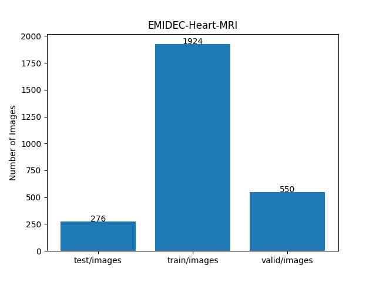 
 
As shown above, the number of images of train and valid datasets is large enough to use for a training set of our segmentation model.
  
<h3>
2.2 Derivation of EMIDEC-Heart-MRI-ImageMask Dataset
</h3>
The folder structure of the original <b>emidec_dataset</b> is the following.
<pre>
./emidec-dataset-1.0.1
├─Case_N006
│  ├─Contours
│  │  └─Case_N006.nii
│  └─Images
│      └─Case_N006.nii
...
└─Case_P100
    ├─Contours
    │  └─Case_P100.nii
    └─Images
        └─Case_P100.nii
</pre>
<b>Step 1</b> 
We generated a 512x512 pixsels cropped PNG ImageMask Dataset with colorized masks from the NIfTI files in 
all
<b>Contours</b> and <b>Images</b> folders, by using the follwing <b>class(pixel value of contour mask)</b> and 
<b>color_mapping table</b>.  
<b>class_color_map={1:blue, 2:green, 3:red, 4:cyan}</b>
   
<b>Step 2</b> 
We finally generated our own <a href="https://drive.google.com/file/d/17P8uRqDm4flK6sXtcm7rY2XU7ciESE2Y/view?usp=sharing"><b>Augmented-EMIDEC-Heart-MRI-ImageMask-Dataset-V2</b></a>
from the PNG ImageMask Dataset 
by using the following offline image augmentation tools. 
<a href="https://github.com/sarah-antillia/Image-Deformation-Tool">Image-Deformation-Tool</a> 
<a href="https://github.com/sarah-antillia/Image-Distortion-Tool">Image-Distortion-Tool</a> 
 
<h3>
2.3 Train Sample Images and Masks
</h3>
<b>Train_sample images</b> 
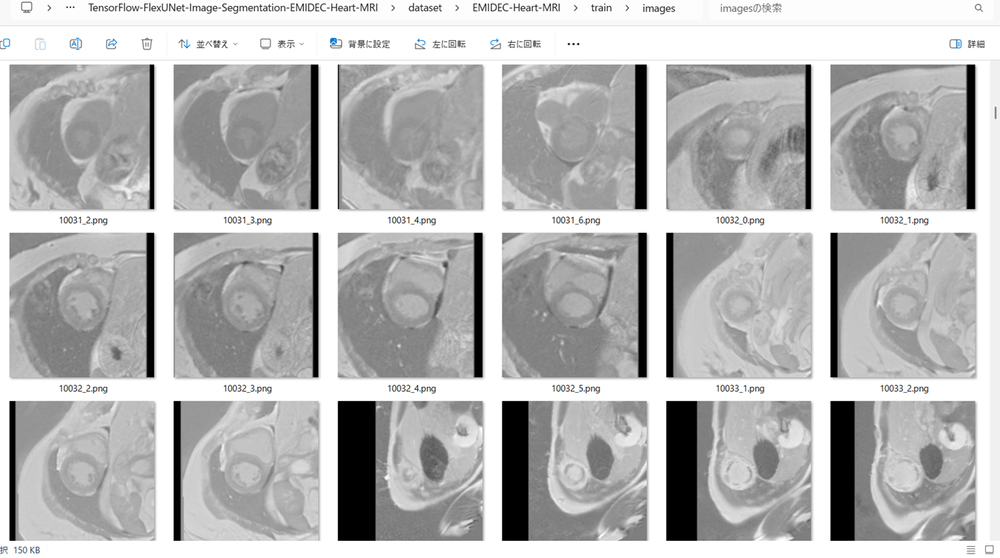
 
<b>Train_sample_masks</b> 
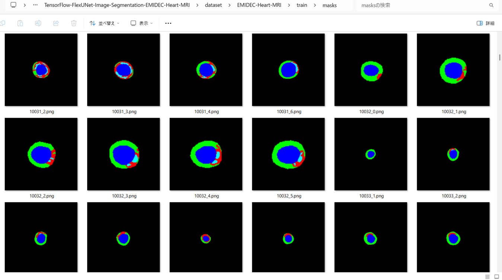
 
<h3>
3 Train TensorflowFlexUNet Model
</h3>
 We trained EMIDEC-Heart-MRI TensorflowFlexUNet Model by using the following
<a href="./projects/TensorFlowFlexUNet/EMIDEC-Heart-MRI/train_eval_infer.config"> <b>train_eval_infer.config</b></a> file.  
Please move to ./projects/TensorFlowFlexUNet/EMIDEC-Heart-MRI and run the following bat file. 
<pre>
>1.train.bat
</pre>
, which simply runs the following command. 
<pre>
>python ../../../src/TensorFlowFlexUNetTrainer.py ./train_eval_infer.config
</pre>

<b>Model parameters</b> 
Defined a small <b>base_filters=16</b> and a large <b>base_kernels=(11,11)</b> for the first Conv Layer of Encoder Block of 
<a href="./src/TensorFlowFlexUNet.py">TensorFlowFlexUNet.py</a> 
and a <b>large num_layers=8</b> (including a bridge between Encoder and Decoder Blocks).
<pre>
[model]
image_width    = 512
image_height   = 512
image_channels = 3
input_normalize = True
normalization  = False
num_classes    = 5
base_filters   = 16
base_kernels  = (11,11)
num_layers    = 8
dropout_rate   = 0.05
dilation       = (1,1)
</pre>

<b>Learning rate</b> 
Defined a small learning rate.  
<pre>
[model]
learning_rate  = 0.00007
</pre>

<b>Loss and metrics functions</b> 
Specified "categorical_crossentropy" and "dice_coef_multiclass". 
<pre>
[model]
loss           = "categorical_crossentropy"
metrics        = ["dice_coef_multiclass"]
</pre>
<b >Learning rate reducer callback</b> 
Enabled learing_rate_reducer callback, and a small reducer_patience.
<pre> 
[train]
learning_rate_reducer = True
reducer_factor     = 0.4
reducer_patience   = 4
</pre>
<b>Early stopping callback</b> 
Enabled early stopping callback with patience parameter.
<pre>
[train]
patience      = 10
</pre>
<b></b> 
<b>RGB color map</b> 
rgb color map dict for EMIDEC-Heart-MRI 1+4 classes. 
<pre>
[mask]
mask_file_format = ".png"
mask_file_format = ".png"
; EMIDEC-Heart-MRI 1+4
;   Background;black,  class1:blue. class2:green, class3:red class4:cyan
rgb_map = {(0, 0, 0):0,(0,0,255):1, (0,255,0):2,(255, 0, 0):3, (0,255,255):4}
</pre>
<b>Epoch change inference callbacks</b> 
Enabled epoch_change_infer callback. 
<pre>
[train]
epoch_change_infer       = True
epoch_change_infer_dir   =  "./epoch_change_infer"
epoch_changeinfer        = False
epoch_changeinfer_dir    = "./epoch_changeinfer"
num_infer_images         = 6
</pre>
By using this epoch_change_infer callback, on every epoch_change, the inference procedure can be called
 for 6 images in <b>mini_test</b> folder. This will help you confirm how the predicted mask changes 
 at each epoch during your training process.    
<b>Epoch_change_inference output at starting (1,2,3)</b> 
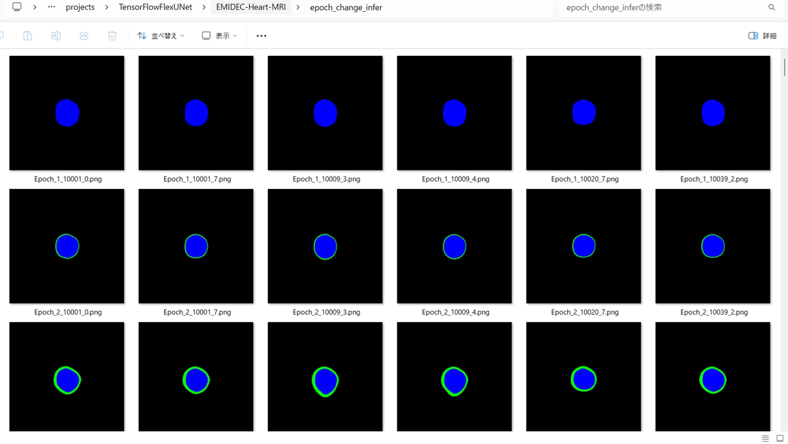 
 
<b>Epoch_change_inference output at middle-point (28,29,30)</b> 
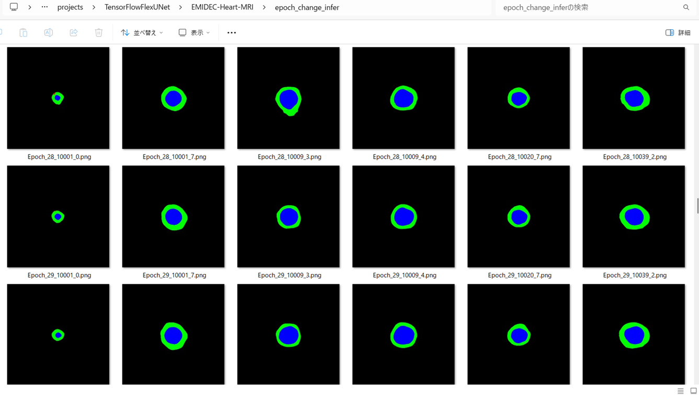 
 
<b>Epoch_change_inference output at ending (58,59,60)</b> 
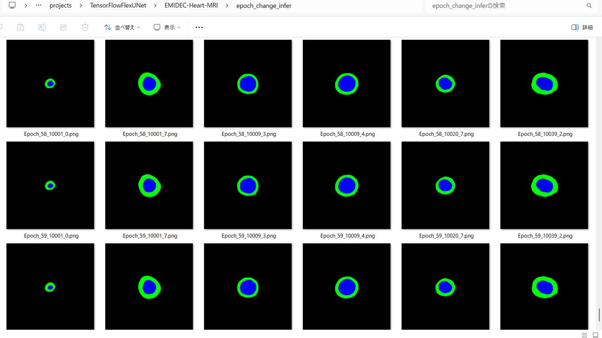 

 
In this experiment, the training process was stopped at epoch 25 by EarlyStoppingCallback.  
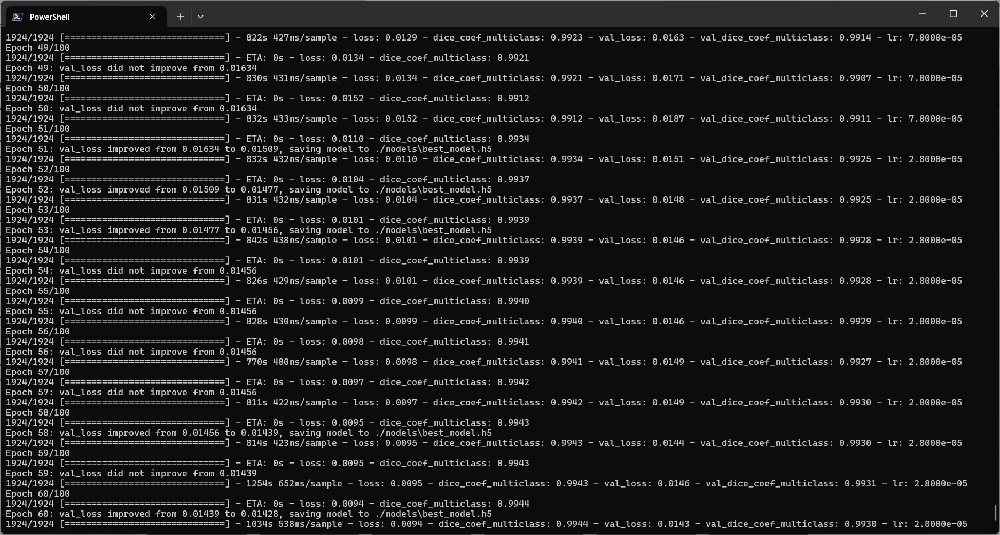 
 
<a href="./projects/TensorFlowFlexUNet/EMIDEC-Heart-MRI/eval/train_metrics.csv">train_metrics.csv</a> 
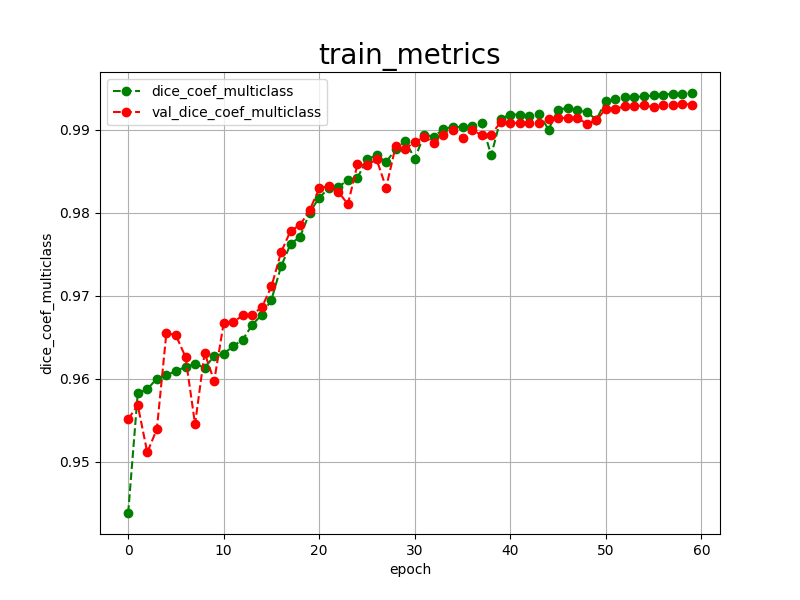 

 
<a href="./projects/TensorFlowFlexUNet/EMIDEC-Heart-MRI/eval/train_losses.csv">train_losses.csv</a> 
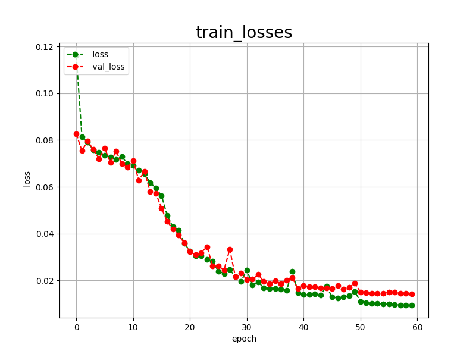 
 
<h3>
4 Evaluation
</h3>
Please move to <b>./projects/TensorFlowFlexUNet/EMIDEC-Heart-MRI</b> folder, 
and run the following bat file to evaluate TensorflowFlexUNet model for EMIDEC-Heart-MRI. 
<pre>
>./2.evaluate.bat
</pre>
This bat file simply runs the following command.
<pre>
>python ../../../src/TensorFlowFlexUNetEvaluator.py  ./train_eval_infer.config
</pre>
Evaluation console output: 
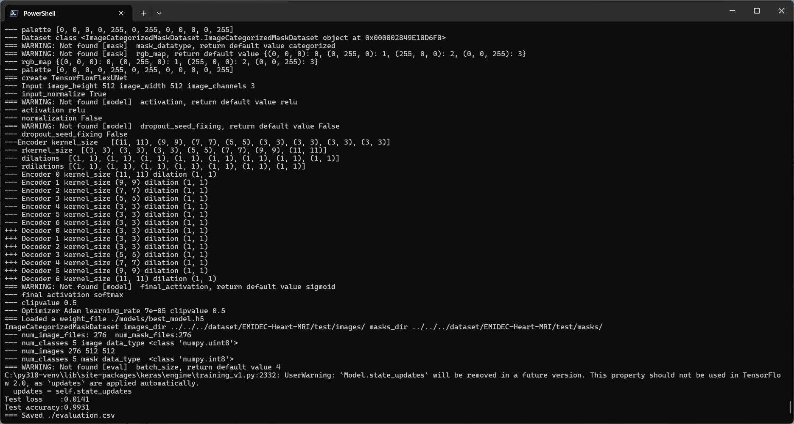
  Image-Segmentation-EMIDEC-Heart-MRI

<a href="./projects/TensorFlowFlexUNet/EMIDEC-Heart-MRI/evaluation.csv">evaluation.csv</a> 
The loss (categorical_crossentropy) to this EMIDEC-Heart-MRI/test was low, and dice_coef_multiclass high as shown below.
 
<pre>
categorical_crossentropy,0.0141
dice_coef_multiclass,0.9931
</pre>
 
<h3>5 Inference</h3>
Please move to <b>./projects/TensorFlowFlexUNet/EMIDEC-Heart-MRI</b> folder 
,and run the following bat file to infer segmentation regions for images by the Trained-TensorflowFlexUNet model for EMIDEC-Heart-MRI. 
<pre>
>./3.infer.bat
</pre>
This simply runs the following command.
<pre>
>python ../../../src/TensorFlowFlexUNetInferencer.py ./train_eval_infer.config
</pre>

<b>mini_test_images</b> 
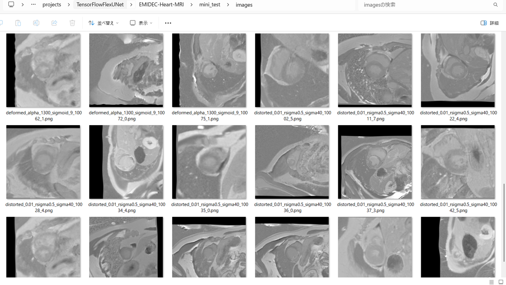 
<b>mini_test_mask(ground_truth)</b> 
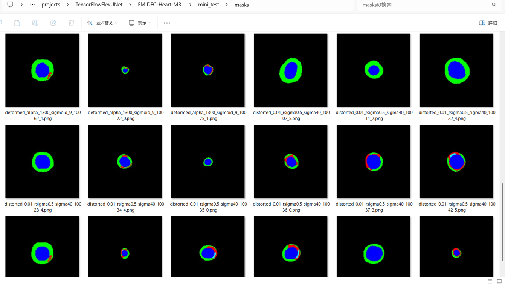 

<b>Inferred test masks</b> 
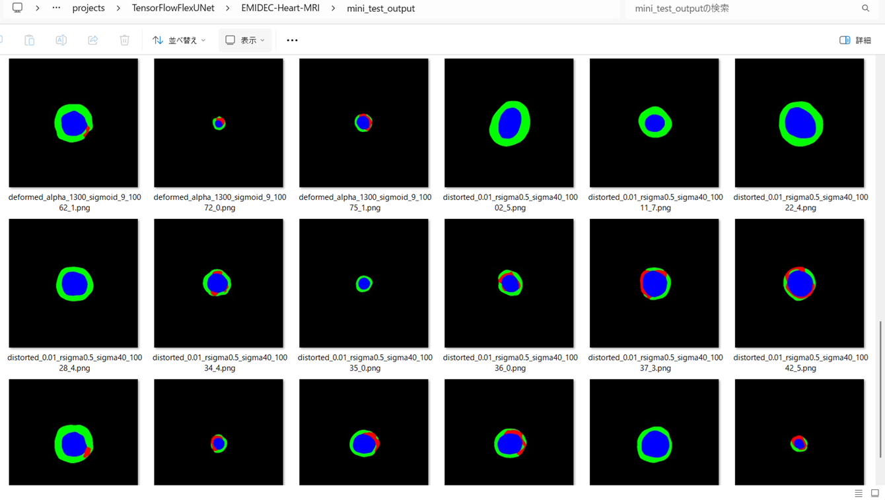 
 

<b>Enlarged images and masks for  EMIDEC-Heart-MRI of 512x512 pixels</b> 
As shown below, the inferred masks predicted by our segmentation model trained by the dataset appear similar to the 
ground truth masks, except the fourth and sixth cases.In these cases,this model failed to detect the class_4 cyan regions.
  
<b>class_color_map={class_1:blue, class_2:green, class_3:red, class_4:cyan}</b>
  
<table>
<tr>
<th>Input: image</th>
<th>Mask (ground_truth)</th>
<th>Prediction: inferred_mask</th>
</tr>
<tr>
<td>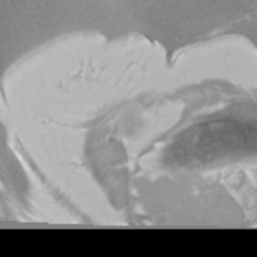</td>
<td>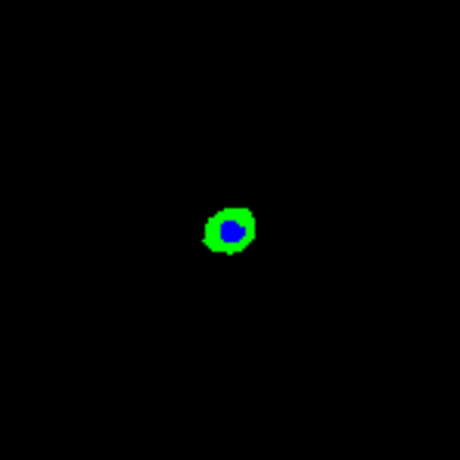</td>
<td></td>
</tr>

<tr>
<td>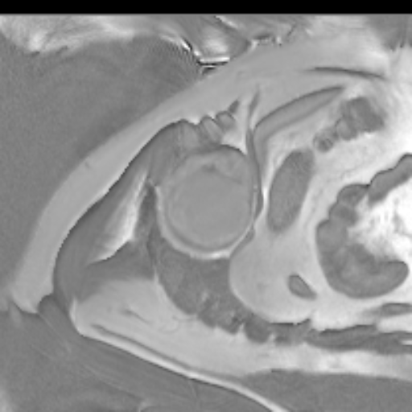</td>
<td></td>
<td></td>
</tr>

<tr>
<td>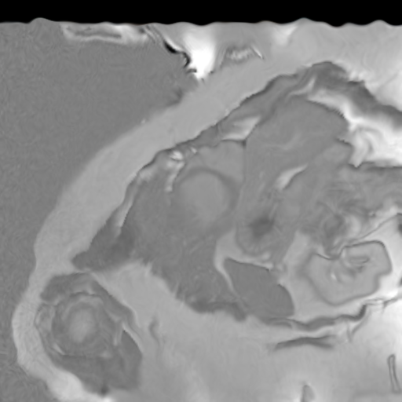</td>
<td>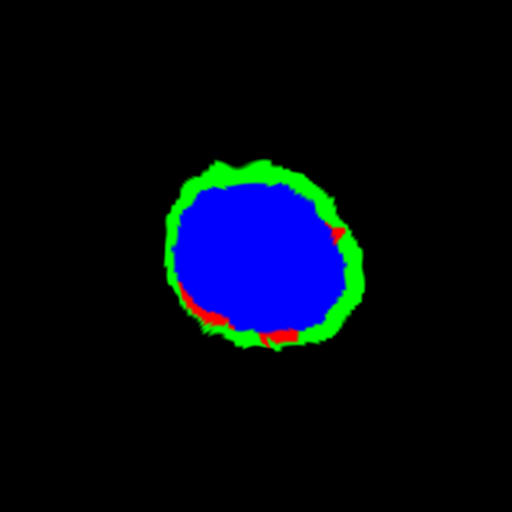</td>
<td>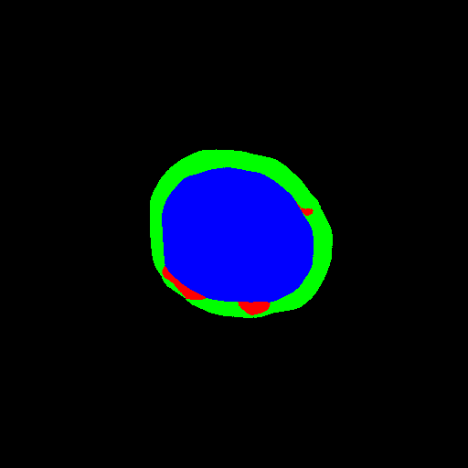</td>
</tr>
<tr>
<td>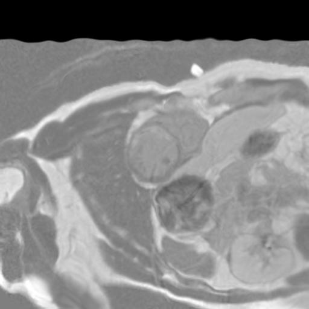</td>
<td>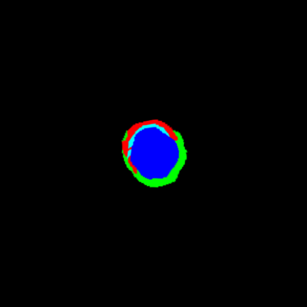</td>
<td>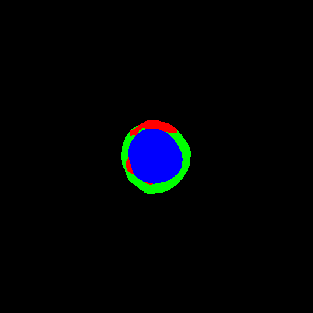</td>
</tr>
<tr>
<td>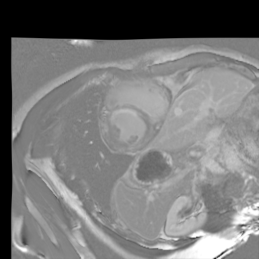</td>
<td></td>
<td>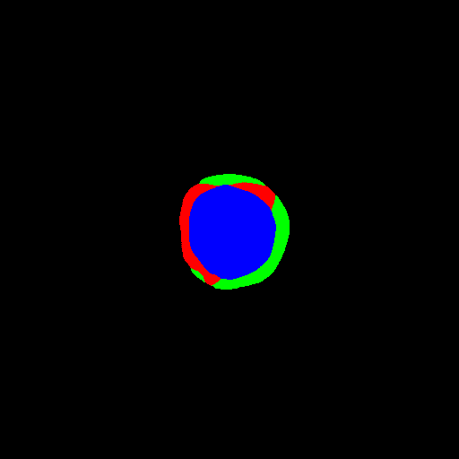</td>
</tr>
<tr>
<td>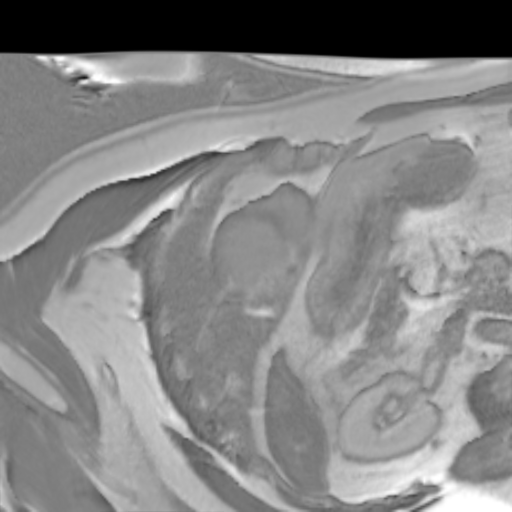</td>
<td>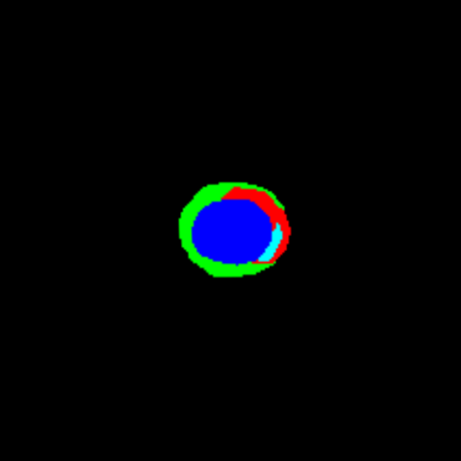</td>
<td>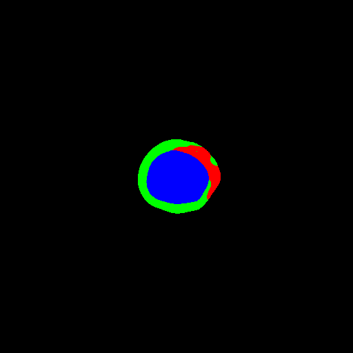</td>
</tr>
</table>

 
<h3>
References
</h3>
<b>1. Contrast-Free Myocardial Infarction Segmentation with Attention U-Net</b> 
Khaled Ali Deeb, Yasmeen Alshelle, Hala Hammoud, Andrey Briko, Vladislava Kapravchuk, 
 Alexey Tikhomirov, Amaliya Latypova, Ahmad Hammoud 
<a href="https://pmc.ncbi.nlm.nih.gov/articles/PMC12984793/">
https://pmc.ncbi.nlm.nih.gov/articles/PMC12984793/
</a>
 
 
<b>2. EMIDEC the database</b> 
<a href="https://emidec.com/dataset">https://emidec.com/dataset</a>
 
 
<b>3. Cardiac Atlas Project</b> 
<a href="https://www.cardiacatlas.org/">https://www.cardiacatlas.org/</a>
 
 
<b>4. TensorFlow-FlexUNet-Image-Segmentation-Model</b> 
Toshiyuki Arai  
<a href="https://github.com/sarah-antillia/TensorFlow-FlexUNet-Image-Segmentation-Model">
TensorFlow-FlexUNet-Image-Segmentation-Model
</a>
 
 
